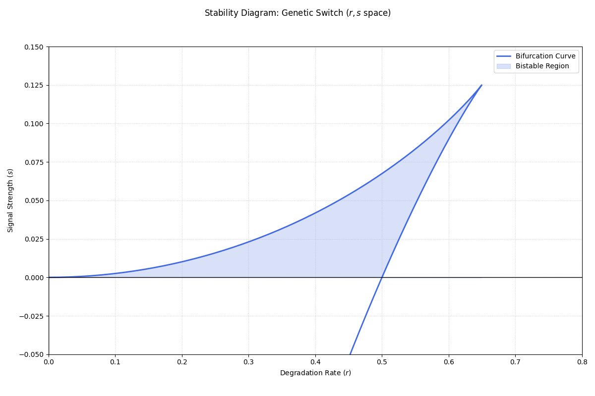

# Coursework Submission: Non-Linear Dynamics, Chaos and Aplications Week 2
**Name:** Stan Daniels. 

**Student Number:** S1116231

## Code:
```python
# ==================================================================
# EXCERSISES WEEK 2 (3.7.5)
# ==================================================================

import numpy as np
import matplotlib.pyplot as plt
import os

class Simulator:
    """
    A simulator for generating and saving stability diagrams for 
    the Genetic Switch model in (r, s) parameter space.
    """
    def __init__(self):
        self.k = 0

    def _r_equation(self, x):
        """
        Calculates the dimensionless degradation rate r for a given x.
        
        Args:
            x (float or ndarray): Dimensionless concentration.
            
        Returns:
            float or ndarray: Calculated r values.
        """
        return 2 * x / (1 + x**2)**2
    
    def _s_equation(self, x):
        """
        Calculates the dimensionless signal strength s for a given x.
        
        Args:
            x (float or ndarray): Dimensionless concentration.
            
        Returns:
            float or ndarray: Calculated s values.
        """
        return x**2 * (1 - x**2) / (1 + x**2)**2

    def plot_and_save(self, x_vals):
        """
        Generates a bifurcation plot in (r, s) space and saves it as a PNG.
        
        Args:
            x_vals (ndarray): The range of concentration values used to 
                              parameterize the bifurcation curves.
        """
        r = self._r_equation(x_vals)
        s = self._s_equation(x_vals)

        fig, ax = plt.subplots(figsize=(12, 8))
        fig.suptitle('Stability Diagram: Genetic Switch ($r, s$ space)')

        ax.plot(r, s, color='royalblue', linewidth=2, label='Bifurcation Curve')
        ax.fill_between(r, s, where=(s >= 0), color='royalblue', alpha=0.2, label='Bistable Region')

        ax.set_xlabel('Degradation Rate ($r$)')
        ax.set_ylabel('Signal Strength ($s$)')
        ax.axhline(0, color='black', linewidth=1)
        ax.axvline(0, color='black', linewidth=1)
        ax.grid(True, linestyle=':', alpha=0.6)
        ax.legend()

        ax.set_xlim(0, 0.8)
        ax.set_ylim(-0.05, 0.15)

        plt.tight_layout(rect=[0, 0.03, 1, 0.95])

        base_path = os.path.dirname(os.path.abspath(__file__))
        save_dir = os.path.join(base_path, "plots")
        
        if not os.path.exists(save_dir):
            os.makedirs(save_dir)

        filename = "Stability_Diagram.png"
        save_path = os.path.join(save_dir, filename)
        
        plt.savefig(save_path)
        print(f"Plot saved successfully at: {save_path}")
        plt.close()

if __name__ == "__main__":
    sim = Simulator()
    x_range = np.linspace(0, 4, 1000)
    sim.plot_and_save(x_range)
```
## Results:
